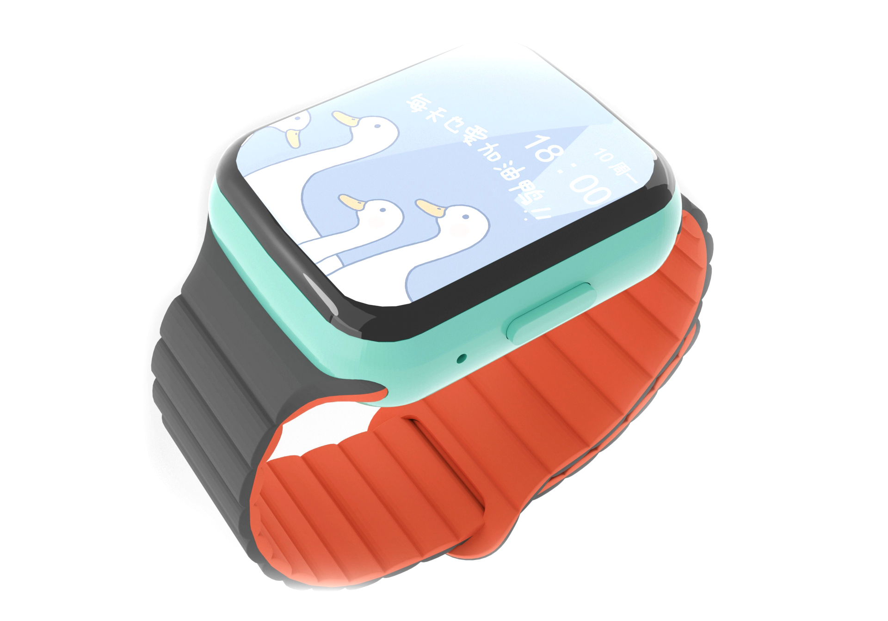
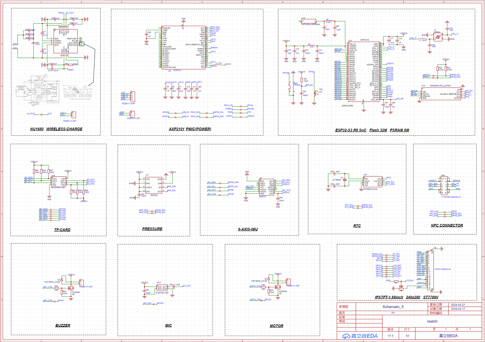
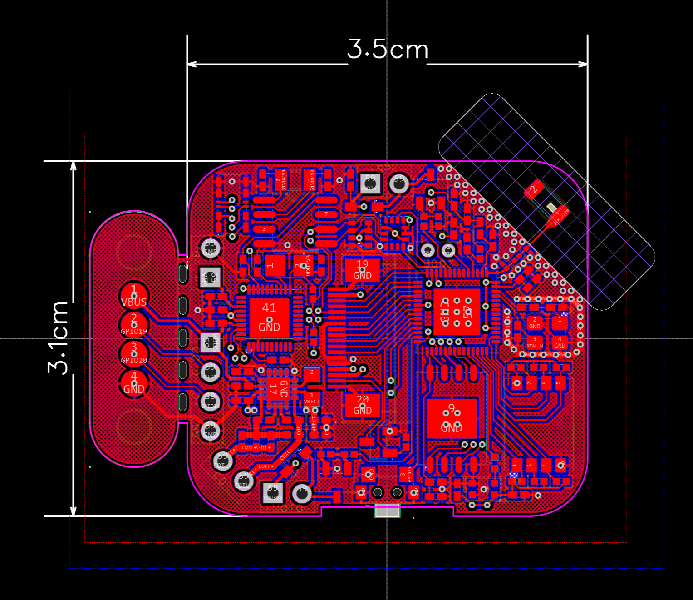
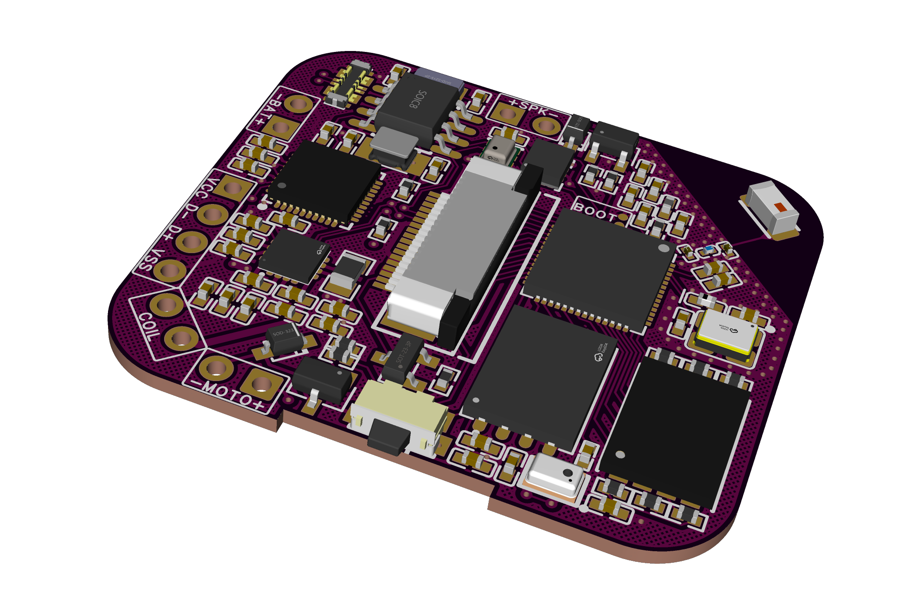
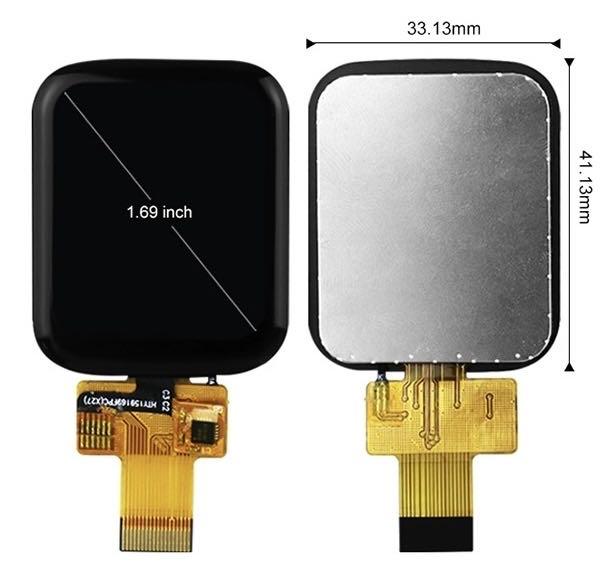
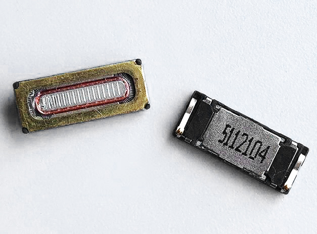
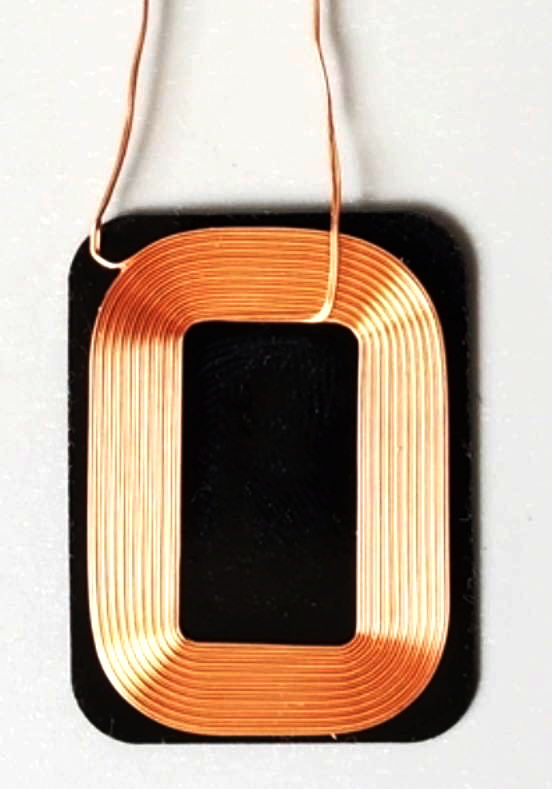
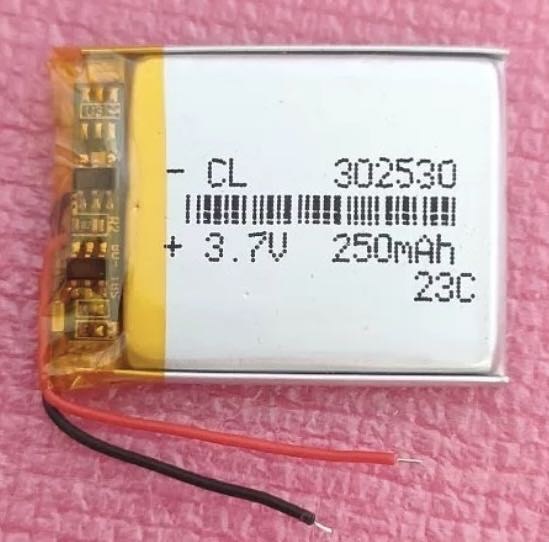
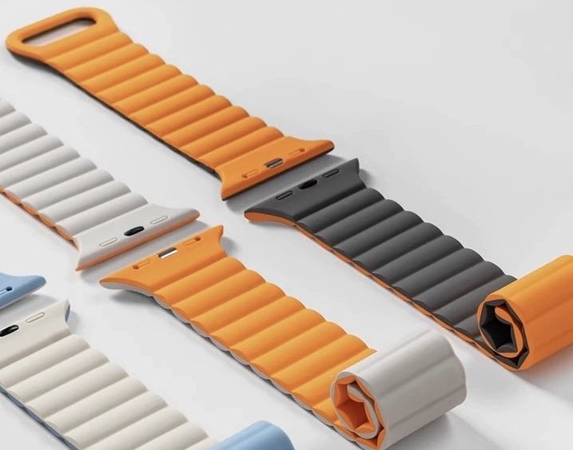
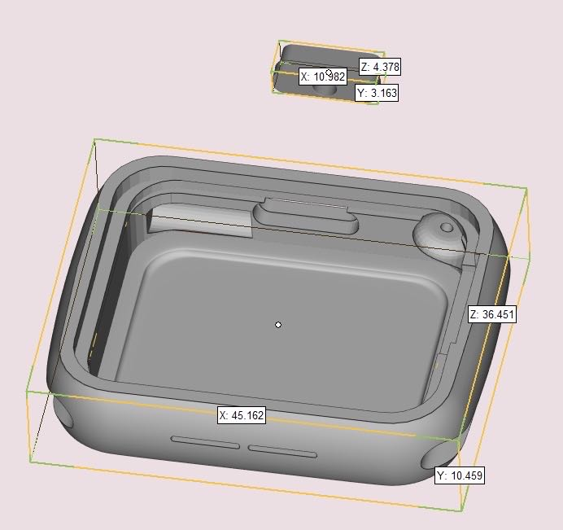

<p align="center">
  
</p>
<p align="center">
    
    
    
</p>



<br>

# Hamboo - ⌚Smartwatch based on Esp32-S3 chip.

---

> **Main Chip**：Esp32-s3 (wifi & bluetooth) <br>
> **Hardware**: Touch screen, microphone, speaker, gyroscope, wireless charging, external RTC, pressure sensor, SDMMC <br>
> **Software Planning**: OTA, dial, music player, sports record, games, NFC access bus card, Bluetooth dial, alarm clock, stopwatch, timer... <br>

## Design

### 📐 Blender modeling and 3d printing


[Hamboo-V4.blend](docs%2FHamboo-V4.blend)

### 🖥️ Circuit diagram & PCB

<div>



</div>

[hamboo-pcb.zip](docs%2Fhamboo-pcb.zip)

## 💰 Cost & 🎧Peripheral

- **pcb**: ￥0 （4-layer board free play [lceda](https://lceda.cn/)）
- **3d printing**: ￥20 （White resin material）
- **bom**: ¥? (calculating...)
- **screen**: ￥30 （P169H002-CTP 1.69inch）
- **battery**: ￥7 (size: 302530, 3.7v 250mAh)
- **watchband**: ￥13 (for apple watch(7/8/9))
- **others**: ￥30 (speaker size: 1506、motor size: 3610、wireless charging coil: 3021 12.5uH)

<div>
    
    
    
    
    
    
    
</div>

## ⌨️ hamboo-rs

### 🎬 Getting Start

```bash
# Setting environment
cargo install espup
espup install
# To uninstall
# espup uninstall
export . ~/export-esp.sh
# Firmware 
cargo check
cargo run --release
# Run with simulator
cargo run --features=simulator --release
```

### 📋 Planning

- [X] Display
- [X] Touch
- [ ] Slint
- [ ] Other drivers
- [ ] OTA
- [ ] Watch dial
- [ ] 🎮 Games
- [ ] NFT support

### 📄 License

[MIT](https://opensource.org/licenses/MIT)

Copyright (c) 2014-present, Michael