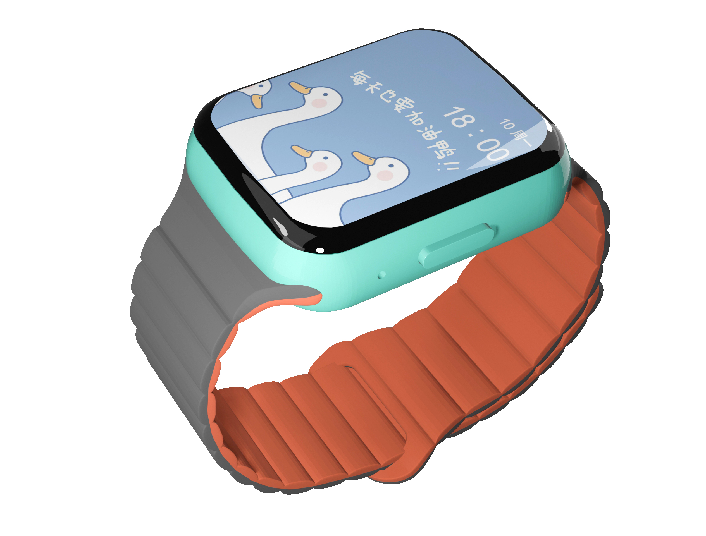

<p align="center">
  
</p>
<p align="center">
    
    
    
</p>



<br>

# Hamboo - Smartwatch based on Esp32-S3 chip.


---


> Main Chip：Esp32-s3 (wifi & bluetooth)
>
> Hardware: Touch screen, microphone, speaker, gyroscope, wireless charging, external RTC, pressure sensor, SDMMC
>
> Software planning: OTA, dial, music player, sports record, games, NFC access bus card, Bluetooth dial, alarm clock, stopwatch, timer...

## Design


### 📦 Blender modeling and 3d printing


[Hamboo-V4.blend](docs%2FHamboo-V4.blend)

### 🧱 Circuit diagram & PCB

<div>


</div>

[hamboo-pcb.zip](docs%2Fhamboo-pcb.zip)

## 📘 Cost

- **pcb**: ￥0 
- **3d printing**: ￥20
- **bom**: calculating...
- **screen**: ￥30
- **battery**: ￥7
- **watchband**: ￥13
- **others**: ￥30

### ⌨️ Getting Start

```bash
# Setting environment
cargo install espup
espup install
# To uninstall
# espup uninstall
export . ~/export-esp.sh
# Firmware 
cargo check
cargo run --release
# Run with simulator
cargo run --features=simulator --release
```

## 🛠️ Planning
- [X] Display
- [X] Touch
- [ ] Other drivers
- [ ] OTA
- [ ] Dial plate
- [ ] Games
- [ ] NFT support

## License

[MIT](https://opensource.org/licenses/MIT)

Copyright (c) 2014-present, Michael